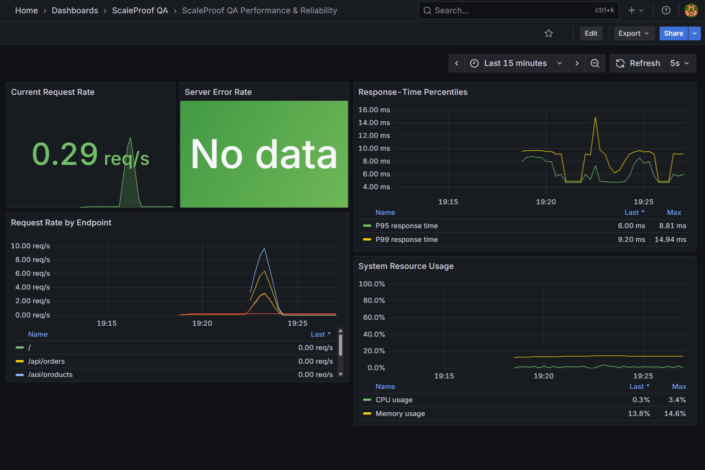
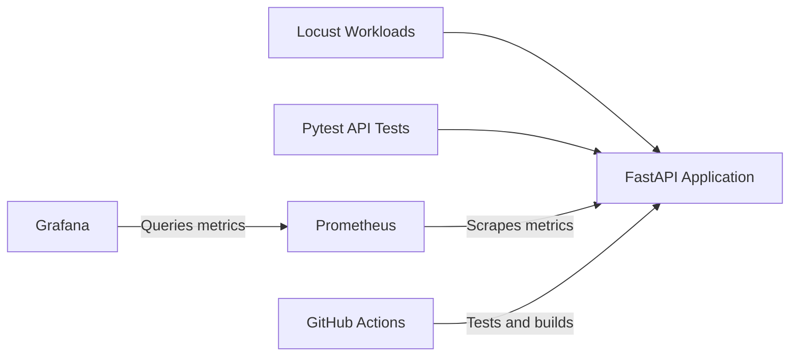
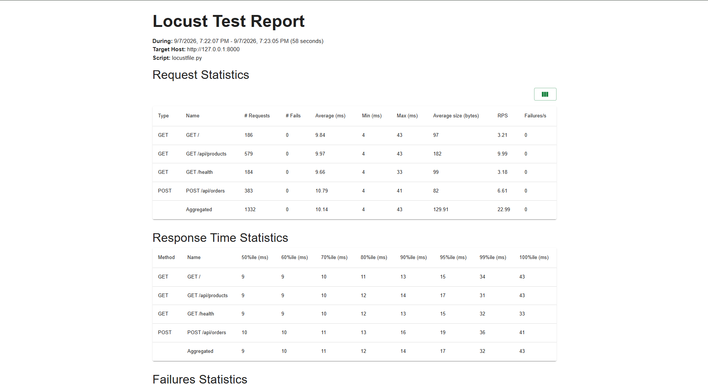

# ScaleProof QA

ScaleProof QA is an enterprise-style performance testing and reliability engineering platform built to validate API behavior under normal traffic, load, stress, spike, and controlled failure conditions.

The project combines automated API testing, configurable Locust workloads, performance quality gates, reliability testing, Prometheus metrics, Grafana dashboards, Docker containerization, and GitHub Actions CI.

## Monitoring Dashboard



## Key Capabilities

- Automated functional API testing with Pytest
- Smoke, baseline, load, stress, spike, and reliability test profiles
- Configurable performance thresholds and automatic pass/fail evaluation
- HTML and JSON performance reports
- Controlled latency and service-failure simulation
- Prometheus application and system metrics
- Pre-provisioned Grafana monitoring dashboard
- Docker Compose environment for the API, Prometheus, and Grafana
- GitHub Actions workflow for testing and container-build validation


## Architecture



## Technology Stack

- Python 3.13
- FastAPI and Uvicorn
- Pytest
- Locust
- Prometheus Client
- Psutil
- Prometheus
- Grafana
- Docker and Docker Compose
- GitHub Actions

## Project Structure

```text
ScaleProof QA/
├── .github/
│   └── workflows/
│       └── ci.yml
├── app/
│   ├── main.py
│   └── metrics.py
├── config/
│   ├── load_profiles.py
│   └── thresholds.py
├── docs/
│   └── images/
│       ├── grafana-dashboard.png
│       └── locust-load-report.png
├── monitoring/
│   ├── prometheus.yml
│   └── grafana/
│       ├── dashboards/
│       │   └── scaleproof-dashboard.json
│       └── provisioning/
│           ├── dashboards/
│           │   └── dashboard.yml
│           └── datasources/
│               └── prometheus.yml
├── performance_tests/
│   ├── evaluator.py
│   ├── locustfile.py
│   ├── reliability_locustfile.py
│   └── result_reporter.py
├── tests/
│   └── test_api.py
├── .dockerignore
├── .env.example
├── .gitignore
├── compose.yaml
├── Dockerfile
├── pytest.ini
├── requirements.txt
└── run_performance.py
```

## Local Setup

### Prerequisites

- Python 3.13 or later
- Docker Desktop
- Git

### Install the Project

Clone the repository and enter the project directory:

```powershell
git clone https://github.com/jahnavi-gummalla/ScaleProof-QA.git
cd ScaleProof-QA
```

Create and activate a virtual environment:

```powershell
python -m venv .venv
Set-ExecutionPolicy -Scope Process -ExecutionPolicy RemoteSigned
.\.venv\Scripts\Activate.ps1
```

Install the dependencies:

```powershell
python -m pip install --upgrade pip
pip install -r requirements.txt
```

Run the automated tests:

```powershell
pytest
```

Start the API locally:

```powershell
python -m uvicorn app.main:app --reload
```

The application will be available at:

- API: `http://127.0.0.1:8000`
- API documentation: `http://127.0.0.1:8000/docs`
- Prometheus metrics: `http://127.0.0.1:8000/metrics`

## Run with Docker

Build and start the complete application and monitoring stack:

```powershell
docker compose up --build -d
```

Confirm that all containers are running:

```powershell
docker compose ps
```

Open the services:

- ScaleProof API: `http://127.0.0.1:8000`
- Prometheus: `http://127.0.0.1:9090`
- Prometheus targets: `http://127.0.0.1:9090/targets`
- Grafana: `http://127.0.0.1:3000`

Default Grafana credentials:

```text
Username: admin
Password: scaleproof
```

The Prometheus datasource and ScaleProof QA dashboard are provisioned automatically.

Stop the containers without deleting the Grafana data volume:

```powershell
docker compose down
```

## Performance Testing

The available test profiles are:

- `smoke`: Quick traffic validation
- `baseline`: Normal performance benchmark
- `load`: Sustained expected traffic
- `stress`: Traffic beyond expected capacity
- `spike`: Sudden traffic increase
- `reliability`: Controlled latency and failure validation

Make sure the Docker containers are running:

```powershell
docker compose up -d
```

Run a profile using:

```powershell
python run_performance.py smoke
```

Replace `smoke` with any other profile name when required. For example:

```powershell
python run_performance.py load
python run_performance.py reliability
```

Each run evaluates the configured performance thresholds and generates HTML and JSON reports inside the `reports` directory.

## Verified Results

### Load-Test Report



### Automated API Testing

- 10 tests passed
- Functional, validation, metrics, latency and controlled-failure scenarios covered

### Load Test

- 50 concurrent users
- 1,332 requests
- 0 failures
- 22.99 requests per second
- 10.14 ms average response time
- 17 ms P95 response time
- 32 ms P99 response time
- Result: **PASS**

### Reliability Test

- 20 concurrent users
- 348 requests
- 0 unexpected failures
- 66 expected HTTP 503 responses validated
- 100.61 ms average response time
- 260 ms P95 response time
- 360 ms P99 response time
- Result: **PASS**

The Grafana dashboard also captured the traffic, latency, error-rate and system-resource behavior during these test runs.

## API Endpoints

| Method | Endpoint | Purpose |
|---|---|---|
| `GET` | `/` | Confirms that the API is available |
| `GET` | `/health` | Returns the application health status |
| `GET` | `/api/products` | Returns sample product data |
| `POST` | `/api/orders` | Creates and validates an order |
| `GET` | `/metrics` | Exposes Prometheus metrics |
| `GET` | `/api/reliability/simulate` | Simulates controlled latency and service failure |

Example reliability request with a 500 ms delay:

```text
http://127.0.0.1:8000/api/reliability/simulate?delay_ms=500
```

## Continuous Integration

The GitHub Actions workflow runs automatically for pushes and pull requests targeting the `main` branch.

The pipeline performs these quality checks:

1. Sets up Python 3.13
2. Installs the project dependencies
3. Runs all Pytest API tests
4. Validates the Docker Compose configuration
5. Builds the ScaleProof API container

A failed test, invalid Compose configuration or unsuccessful container build causes the workflow to fail, preventing unnoticed defects from passing the quality gate.